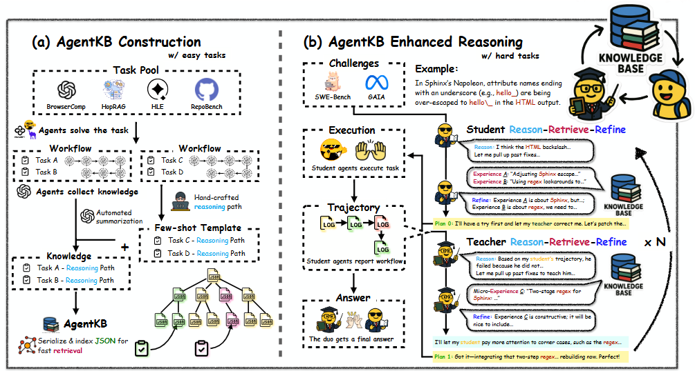

<div align="center">

<h2>Agent KB: Leveraging Cross-Domain Experience for Agentic Problem Solving</h2>

</div>

<div align="center">

  <a href='https://arxiv.org/abs/2507.06229'></a>
  <a href='https://www.python.org/downloads/release/python-31210/'></a>
  <a href='https://github.com/OPPO-PersonalAI/OAgents/blob/main/LICENSE'></a>
  
</div>
This is the official repository for the paper "Agent KB: Leveraging Cross-Domain Experience for Agentic Problem Solving" **(ICML 2025 CFAgentic Workshop Best Paper Runner-Up Award)**.

<div align="center">
    
</div>

## Key Features of Agent KB
- Hierarchical Memory Structure: Combines working memory, episodic memory, and semantic knowledge base.
- Agentic Reasoning: Supports autonomous decision-making and planning using LLMs.
- Cross-Domain Adaptability: Designed for generalization across different task domains (e.g., QA, coding, planning).
- Modular Design: Easy to integrate with various benchmarks and environments.


## GAIA Part

To start, follow the steps below:

### Access to the main part of GAIA

```bash
cd ./Agent-KB-GAIA/examples/open_deep_research
```

---

### Install dependencies

Run the following command to install the required dependencies from the `requirements.txt` file:

```bash
pip install -r requirements.txt
```
---
### Install the development version of `smolagents`

```bash
pip install -e ../../.[dev]
```

#### Set up environment variables

The agent uses the `SearchTool` for web search, which requires an environment variable with the corresponding API key, based on the selected provider:
- `SERP_API_KEY` for SerpApi: [Sign up here to get a key](https://serpapi.com/users/sign_up)

Depending on the model you want to use, you may need to set environment variables. You need to set the `OPENAI_BASE_URL` and `OPENAI_API_KEY` environment variable.

---

### Usage test

#### Step 1: Prepare the Data
Download the GAIA dataset and place it under the following directory:
```
./data/gaia
```
The expected directory structure is as follows:
```
├── data
│   ├── gaia
│       ├── test
│       └── validation
```
#### Step 2: Test run on GAIA

You're now all set to run on GAIA! Simply execute the run_gaia.py script like so:
```bash
python run_gaia.py --model-id openai:gpt-4.1 --model-id-search openai:gpt-4.1 --run-name gpt-4.1-gaia
```
If you'd like to use different questions or datasets, you can refer to the run_gaia.py script for guidance and make the necessary adjustments.

---

### Agent KB usage
Now, let's start configuring Agent KB.

#### Step 1: Prepare the Knowledge Base Data
Format your knowledge base samples properly and save them in the following file:
```
./agent_kb/agent_kb_database.json
```
Each sample in the JSON file should follow this structure:
```
{
  "question": "",
  "agent_planning": "",
  "search_agent_planning": "",
  "agent_experience": "",
  "search_agent_experience": ""
}
```

#### Step 2: Start the Agent KB Service
Launch the Agent KB service by running the script below:
```bash
python ./agent_kb/agent_kb_service.py
```

#### Step 3: Execute the Run Command
Once everything is configured, run the main script using a command similar to the following example:
```bash
python run_gaia.py --model-id openai:gpt-4.1 --model-id-search openai:gpt-4.1 --run-name gpt-4.1-gaia --agent_kb --concurrency 1
```

---

## SWE-bench Part

### Access to main part of SWE-bench

```bash
cd ./Agent-KB-SWE-bench/scripts
```

Please note that all the files mentioned below are in the "scripts" directory.

---

### Running Inference

```bash
bash run_swe_bench_hints_agentless_repo.sh

bash run_swe_bench_agentless.sh

bash run_swebench_eval_hints_agentless_repo.sh
```

Other scripts support:

* **Hint variants**: `repo_2nd`, `all_bench_hints`
* **Baselines**: `plain`, `plain_qwen`, `plain_claude`

---

### Script Guide

#### Build & Setup

| Script                  | Description                                |
| ----------------------- | ------------------------------------------ |
| `build_env.sh`          | Build and set up Docker-based environment. |
| `build.sh`              | Local build script (e.g., hint databases). |
| `run_infer_template.sh` | Base template for LLM prompt runs.         |

---

### Inference Scripts

#### With Hints (Agentless Subset)

| Script                                             | Hint Source       | Description                     |
| -------------------------------------------------- | ----------------- | ------------------------------- |
| `run_swe_bench_hints_agentless.sh`                 | location hints     | location hints for baseline.     |
| `run_swe_bench_hints_agentless_repo.sh`            | RepoClassBench 1st round | Main Agent KB reasoning setup.       |
| `run_swe_bench_hints_agentless_repo_2nd.sh`        | RepoClassBench refined | Deeper/longer hints.            |
| `run_swe_bench_hints_agentless_all_bench_hints.sh` | Combined          | Merged hints for high coverage. |


---

### Baselines (No Hints)

| Script                          | Model  | Description                  |
| ------------------------------- | ------ | ---------------------------- |
| `run_swe_bench_plain.sh`        | GPT-4  | Plain run on full benchmark. |
| `run_swe_bench_plain_claude.sh` | Claude | Claude 3.7    |
| `run_swe_bench_plain_qwen.sh`   | Qwen   | Qwen 3        |

---

### Evaluation Scripts

| Script                                                 | Matches                     |
| ------------------------------------------------------ | --------------------------- |
| `run_swebench_eval_plain.sh`                           | Baseline on full set        |
| `run_swebench_eval_agentless.sh`                       | Location hints  |
| `run_swebench_eval_hints_agentless_repo.sh`            | Location hints, RepoClassBench hint|
| `run_swebench_eval_agentless_repo_2nd.sh`              | Location hints, RepoClassBench refined subset |
| `run_swebench_eval_agentless_all_bench_hints.sh`       | Location hints, all hints subset |
| `run_swebench_eval_plain_claude.sh`                    | Claude baseline eval        |
| `run_swebench_eval_plain_qwen.sh`                      | Qwen baseline eval          |


## Acknowledgement
This work builds upon and adapts code from the official implementations of two prominent open-source frameworks:

- **[smolagents](https://github.com/huggingface/smolagents )** — a lightweight, flexible, and powerful library designed to enable the rapid development and deployment of AI agents with minimal effort.
- **[OpenHands](https://github.com/All-Hands-AI/OpenHands )** — an advanced platform enabling AI-powered software development agents capable of interacting with code, terminals, and APIs just like human developers.

These frameworks were instrumental in validating the effectiveness and performance of our proposed methods. We extend our gratitude to the contributors and maintainers of both projects for their foundational work in advancing agent-based systems.

## Cite Us
```
@article{tang2025agent,
  title={Agent KB: Leveraging Cross-Domain Experience for Agentic Problem Solving},
  author={Tang, Xiangru and Qin, Tianrui and Peng, Tianhao and Zhou, Ziyang and Shao, Daniel and Du, Tingting and Wei, Xinming and Xia, Peng and Wu, Fang and Zhu, He and others},
  journal={arXiv preprint arXiv:2507.06229},
  year={2025}
}
```

---

## Star ⭐

<div align="center">

[](https://github.com/OPPO-PersonalAI/Agent-KB)

</div>
